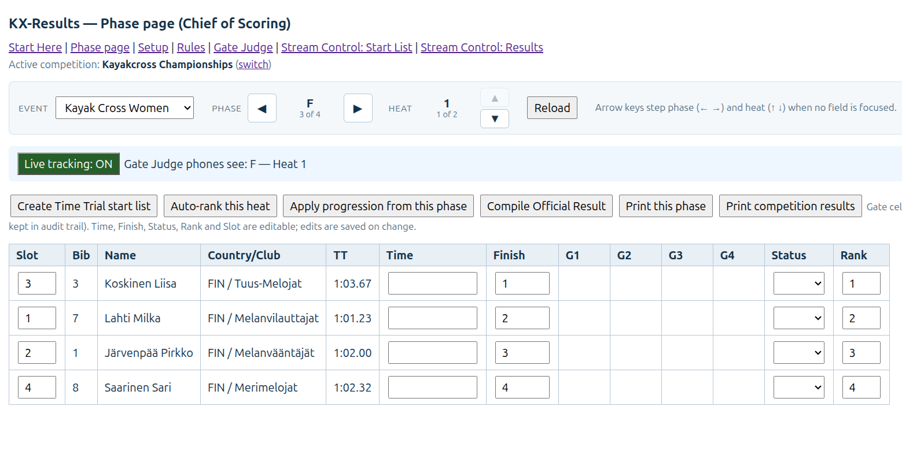

# kx-results - Result service for Kayak Cross competitions 

KX-Results is a complete, self-hosted result service for Kayak Cross competitions — from national races to international events using ICF rules. 

The software runs locally on any Windows or Linux PC and serves every role on the field of play through the browser: the Chief of Scoring manages events and results on a PC, Gate Judges record penalties in real time from their mobile phones, and the Streaming Operator gets ready-made, transparent HTML graphics for the streaming software. Rule-based progression systems make KX-Results adapt automatically to any field size, while live updates judges, scoring, and broadcast graphics in sync — heat after heat. 

Start lists and results can be printed as PDF, and results sync easily to a public website for spectators.

Main screen to orgestrate the compeition:
 

## Features

- Create unlimited competitions with unlimited events
- Automatic ranking and creation of next competition phase based on the progression system (that you create also by yourself).
- Upload athletes to the events from the CSV file (integration to starttiin.fi also available for Finns).
- Split time can be used in Time Trial
- Create your own progression system (with the limitations of  the software) or use [ready made rules](https://github.com/proalvo/kx-results/tree/main/kx-server/rules).
- Publish results in Internet in real-time (at website with *kx-web* installed, such as [wwcf.fi/kx-results](https://wwcf.fi/kx-results)
- Print result as PDF.
- Add header and footer to PDFs.
- Start lists and results are ready available for the live streaming.
- Leaderboard for on site competition information 

## How to install and use the software

1. Install [node](https://nodejs.org/) to your computer. This has been tested with Linux/Mint but 'should' work with Windows also, maybe even with Apple.
2. Download this zip-file from Google Drive [kx-server.zip](https://drive.google.com/file/d/1G6PX_RlTg6paHmjFBTSN9VG4PY70nzPV/view?usp=drive_link)
3. Extract files to your computer disk. 
4. Open the terminal software in your computer and go to the *kx-server* directory
5. Start the software with command `ǹode server.js`. Empty database for the competition is created also - without rules (see installation step #7).
6. Open your web browser and enter `http://localhost:3000` as an address. Everything should look good now, but without any competition data, and no rules.
7. Stop the software by pressing Crtl+C.
8. Upload pre-defined rules from rules archive with command `node scripts/upload-rules.js`.
9. Start again the software `http://localhost:3000` - now you are ready run your first competiton.

Hint! You can give the database and port as command line parameters, e.g. `node server.js test.db 3001`. You cannot omit the database part if you want to use other database than default, which is *kx.db*. This is great way to create the database for the testing and learning purposes.

## How to upload athletes

See examples of files *KXM-6-athletes.csv* and *KXN-8-athletes.csv*. There are ready mady rule sets for 6 and 8 athletes, so it is fast to test with those files. 

- You can upload all athletes to the different events with one file.
- You can upload athletes with multiple files e.g. early birds with one file and last minute parcipants with an other file.

**First row of the CSV file is for instructions and always skipped.**

Format: ```event;bib;first_name;last_name;club;country;icf_id;nf_id```
- *event* is the event code (e.g. KXM)
- *bib*; the bib can be text or number
- *first_name*
- *last_name*
- *club*; club name
- *country*; 3 letter country code (e.g. FIN)
- *icf_id*; (optional) this is ICF's ID for athlete, which is provided by [Sports Data Platform](https://www.canoeicf.com/sports-data-platform)
- *nf_id*; (optional) this is national ID for the athlete, e.g. Sportti ID in Finland. 

Example of the one row without icf_id and nf_id:
`MX1;1;Joh;Smith;Whitewater Canoeing Finland;FIN;;`

## Leaderboard

The Leaderboard provides the current event status at a glance on a single screen. The application includes a carousel that automatically displays all events one after another.

For the best viewing experience, use a 24" monitor or larger and set your browser to full-screen mode. In Chrome, press F11 to enter full-screen mode.

If you are running a smaller competition, you can increase or decrease the font size using Ctrl + mouse wheel:

- Hold Ctrl and scroll the mouse wheel up to make the text larger.
- Hold Ctrl and scroll down to make the text smaller.

URL:
```
http://{ip-address}:{port}/leaderboard
or
http://{ip-address}:{port}/leaderboard?interval={time in seconds}
```
For example:
```
http://localhost:3000/leaderboard
```

You can use second computer to show the leaderboard, then use an IP address of the your computer where you are running kx-results. `ifconfig` (Linux) and `ipconfig` (Windows) commands can be used to find out the IP address of the kx-results computer.

## Integrations

kx-results has integration to [startiin.fi](https://startiin.fi) to import athletes. Starttiin.fi is system by [Finnish Rowing and Canoing Federation](https://melontajasoutuliitto.fi).

- [Instructions for starttiin.fi (in Finnish)](starttiin.md)

## Roadmap

- possible to time schedule of the competiion
- "review" state for faults in public views/streaming.
- export results to the CSV file
- CAPITALISE surname
- first_name_initial should be without dot (.)
- Graphics for the live streaming can be modified easier.
- It should be possible to delete a rule. This is mainly to clean rules with errors when developing a ruleset.  

## Knows bugs or features that require improvement

- Minor: Date format should be according to location (country) of the competition, now weekdays start from Sunday and date/time format is 7/31/2026 8:42:11 PM.
- Medium: Occationally the software can be slow - it may take several seconds when you click the menu item. Good things is that it always works, but it can be annoying or confusing when you do not get immediate respond. Reason for the slow actions is unknown at the moment.


