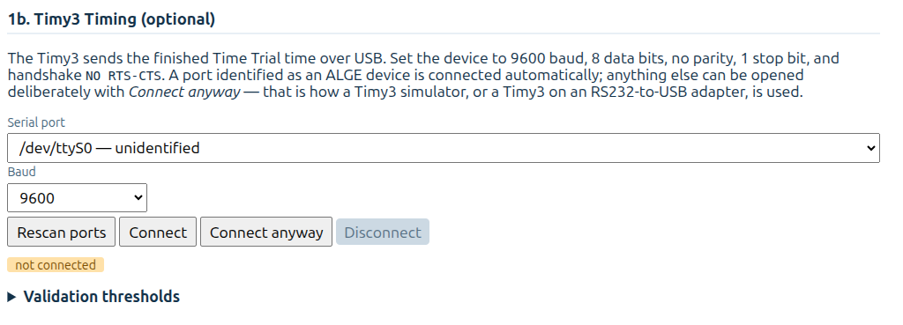
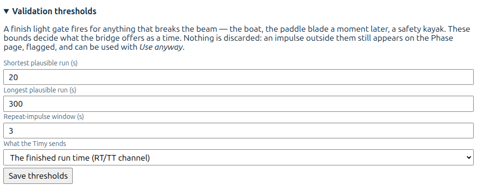

# Alge-Timing Timy(3)

This is an experimental feature made in 9/2026. You should test before using it. **Instuctions are not ready yet**, but you might get the software working anyhow.

Requirements:
- You need Alge Timing's Timy3. It might work with older versions also.
- Timy3 is connected to the PC with USB cable or RS232-USC adapter.
  - If the Timy is connected directly to the PC with USB cable, you need to install Alge's driver.
  - If the Timy is connected to the PC with RS232-USB adapter, then the Timy is not recognized automatically. You might need some USB Serial driver on windows copmuter. Once you figures aout how the RS232-USB is working,just use the "connect anyway" to connect.
 
## Reference documentation

https://alge-timing.com/downloads/userGuides/Timy3-Allgemein-BE.pdf
 
## Installation

Software for the Timy is inluced in the ZIP file if you copy kx-server software from the Github.

Installation:

```
cd {your document root}/kx-server/timy-bridge/
npm install
```
You might get warnings when running the install command. However, the software should work anyhow. Follow the instructions if you want to make sure that the softare is the latest.

You are ready now. Start to software normally

Windows:
```Windows
cd {your document root}/kx-server
node server.js
```
NOTE! if you are running the software on a Linux computer, you must start the software as a super user, otherwise the software does not have permissions to access the USB/serial port. Use `sudo` to start the software.

Linux:
```Linux
cd {your document root}/kx-server
sude node server.js
```

## Configuration

Setup page have instruction to connect to the Timy.

Connect the Timy with with USB cable or RS232-USB adapter cable. If you use the USB cable and Windows 10/11 you need to install the driver which can be downloaded from Alge-Timing's page. 

With Linux you propably need to use the RS232-USB adapter cable. In this case the Timy is not recognised automatically, but you can connect anyway.

 

There are additional setting to set thresholds to recognize faulty impulses from the Timy. 

Timy support different methdos to send the time. Different methods are idenfied by the channel. **Note: I have not been able to test different methods**

- TT - total time
- RT - run time
- c0/c1 - Time sends start time and end time separatly.

 

## How to use

Go to the Page page, and start the Time Trial. Accept valid timestamps.
